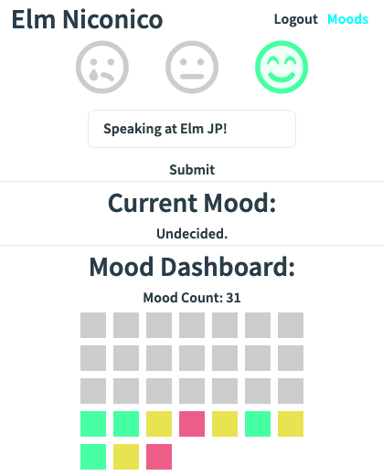

## Elm でフロントエンドを楽しむ

2020-04-21

[BPLL #44](https://bpstudy.connpass.com/event/171284/)

@fab[twitter][matspod](https://twitter.com/matspod)

---

## CONTENTS

@ul[brighten]

- Elm の覚え方
- いま何を作っている？
- 苦戦とよかったこと

@ulend

---

@ul[brighten]

### Elm の覚え方

@ul[brighten]

- Rust 軽く触ってみたら Elm の存在を知った。
- 2019 年に入ってから (Elm 0.19)
- 初 FP 言語。気がつけばはまっていた。

@ulend

+++

### Elm をどうやって覚えている?

@ul[brighten]

- [An Introduction to Elm](https://guide.elm-lang.org/)
- Brian P. Hogan 氏 [Exercises for Programmers](https://pragprog.com/book/bhwb/exercises-for-programmers)
  - ↑ あるあるエキササイズ。新しい言語を覚える時に便利。
- [exercism.io](https://exercism.io/tracks/elm) Elm Track
  - メンターがいてくれるからいい勉強になる。

@ulend

+++

### 何か作った?

@ul[brighten]

- [天気予報アプリ](https://elm-weather-app.netlify.com/)
- [openweathermap.org](https://openweathermap.org)の API 利用
- ある意味定番的エキササイズ
- Decoder, List/map 処理, Http などのいい練習

@ulend

+++

...でもなんだか物足りない

---

## いま何を作っている?

+++

## 以下を求む

@ul[brighten]

- 日常的に使いたいもの → モチベーション
- API も含めて何かを作る → 技術的挑戦
- optional: 仕事で役にたつ何か。

@ulend

+++

## よし、ニコカレを作ろう！

+++

@snap[west]



@snapend

@snap[east span-50 text-center]

@ul[brighten]

### MVP

- ログイン機能
- Mood + メッセージ登録
- 早見表

@ulend

@snapend

+++

### 作り方は簡単

@ul[brighten]

- API を用意する
- Client をチャチャっと作りあげる
- デプロイする
- うぇ〜い

@ulend

+++

### kwsk: API

@ul[brighten]

- [Django Rest Framework](https://www.django-rest-framework.org/)
- Django ベースで簡単に RESTful API が作れる
- [Netlify](https://netlify.com) Lambda + DB でもいけそう

@ulend

+++

### kwsk: Client

@ul[brighten]

- [create-elm-app](https://github.com/halfzebra/create-elm-app)
- ダッシュボードは `Svg` モジール活用
- CSS: とりあえず [tailwind.css](https://tailwindcss.com) で組み立てることに

@ulend

+++

### kwsk: deploy

@ul[brighten]

- localhost 最強説 (...)
- Client: Netlify / API: とりあえず heroku
- 2020 年中晒したい（けれど家庭保育で時間 gagaga

@ulend

+++

### コード見たい方は ↓ へ

- @fab[github][client](https://github.com/MatsLanGoH/elm-niconico)
- @fab[github][api](https://github.com/MatsLanGoH/dj-niconico)
  (だいぶ放置している)

---

## 苦戦したこと

+++

@snap[west]

### ダッシュボードむずい

@ul[brighten]

- その日の最新の登録だけ表示する
- 登録がなければ Unset と表示する
- 個人の時間、朝４〜６時だけなので
- UTC で取得していることに気づかず
- ...って、Elm の話じゃないね。

@ulend

@snapend

@snap[east span-30]


@snapend
+++

#### compiler がロジックミスから守ってくれない

@ul[brighten]

- ログアウトしてもまだダッシュボードが表示されとる？
- トークンを破棄したものの、MoodList そのまま残しているやん
- Model を初期化しよう!

@ulend

+++

### compiler がすべてのタイプミスから守ってくれない

これ正しい ↓

```elm
import Html.Attributes exposing (class)
import Svg exposing (svg, rect)
import Svg.Attributes exposing (viewBox)

    svg
        [ viewBox "0 0 36 36"
        , Svg.Attributes.class "mood_block"]
        [ rect [ x "4" , y "4"] []
```

@[3]
@[7]

+++

### compiler がすべてのタイプミスから守ってくれない

これやったら死ぬ ↓

```elm
import Html.Attributes exposing (class)
import Svg exposing (svg, rect)
import Svg.Attributes exposing (viewBox)

    svg
        [ viewBox "0 0 36 36"
        , class "mood_block"] -- Html.Attributes.class
        [ rect [ x "4" , y "4"] []
```

@[1]
@[7]

+++


+++

### トークン認証、地味にしんどい

@ul[brighten]

- `Http.request` が OK にならない
  - まず CORS 疑おう...
  - NetworkError って何？
  - API のログも見れたから解決できたが...

@ulend

+++

### 地味に困っていること

@ul[brighten]

- JSON なんだかめんどい。（自動化したい）
- ドキュメンテーション物足りない
- モジュール分割（まだ気にしないけど）
- `Time` やたらしんどい。

@ulend

---

## Elm のよいこと

+++

@ul[brighten]

- TEA が楽しい
- 限られた時間でも着々進められる
- リファクタリング怖くない
- いちいちブラウザーみなくてもいいんだ。
- FP 脳みそができつつある

@ulend

+++

@quote[I was coding the entire time and all the code worked on the first try](Richard Feldman)

@fab[youtube][building uis in the dark](https://www.youtube.com/watch?v=sKxEwjKQ5zg)

+++

## おまけ: 楽しいライブラリたち

#### [Awesome Elm](https://github.com/sporto/awesome-elm)

+++

### THANK YOU!

plz follow:

@fab[twitter][matspod](https://twitter.com/matspod)

@fab[github][matslangoh](https://github.com/MatsLanGoH)

---
